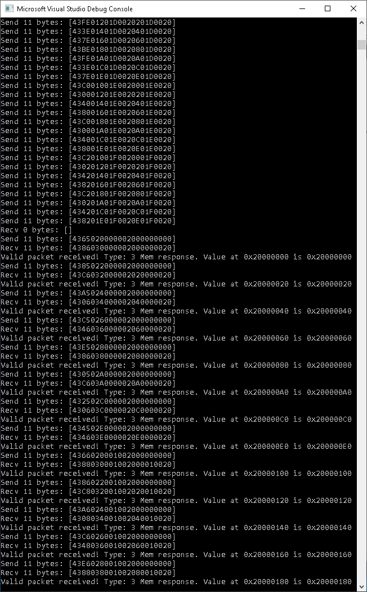

# AXI_UART_DRAM

This was my first project for a lot of things. It was my first project working with multiple clock networks (in this case, 300Mhz, 250Mhz, and 333.25Mhz in the design, plus 1333Mhz for the DRAM itself), AXI4-Full instead of AXI4-Lite, asyncronous FIFO's, using DRAM instead of SRAM, and also my first project doing bidirectional computer <---> FPGA communication.

The UART Lite IP for this example is configured to run with these serial port settings:
- 921,600 bps
- 8 data bits per character
- 1 stop bit
- ODD parity
- XON/XOFF flow control enabled
