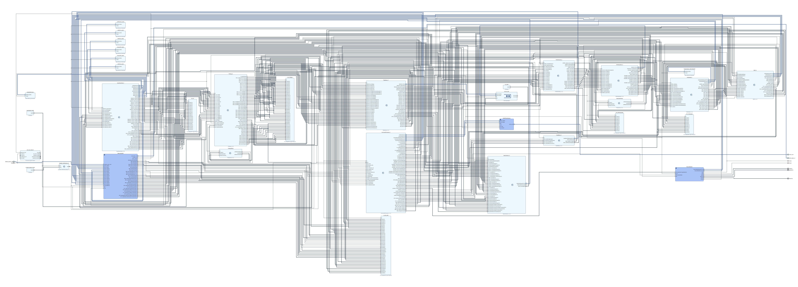

# CPUDrivenGPUTest1 Hardware

Download a PDF of the main graph layout [here](design_1.pdf).

### Packet Processor (PKT)

The Packet Processor is responsible for communicating with the 1Mbit/s serial UART and reading packets off the wire, as well as sending return packets back out to the CPU. It also validates the packets (magic header byte + packet checksum validation) and discards invalid packets. Due to having to interface with the serial UART, the Packet Processor unit runs on a different clock domain (250.0MHz) than the rest of the GPU.

### Command Processor (CMD)

The Command Processor is the brain of the GPU. It runs in one of two modes - either in "single packet" mode processing one packet at a time from the [Packet Processor](#Packet-Processor-PKT), or in "command list" mode executing a command list out of DRAM. The Command Processor is also responsible for managing every other GPU system through state-setting commands, draw commands, and barriers. The Command Processor additionally monitors the GPU systems for "idle" signals and can wait for one or more of these idle signals before proceeding.

### Memory Controller (MEM)

The Memory Controller arbitrates read and write requests for the GPU's main DDR4 DRAM. It is connected to its consumer systems through request/response FIFO queues. The Memory Controller system runs at the DDR4 DRAM interface clock domain at 1333 / 4 = 333.25MHz (this is for DDR4-2666 DRAM).

### Input Assembler (IA)

The Input Assembler reads from memory to load its vertex and index caches, and then it assembles primitives (currently Triangle Lists, Triangle Strips, and Triangle Fans are supported) from those caches to pass the assembled primitives along to the [Triangle Setup](#Triangle-Setup-TRISETUP) unit. It can also cull degenerate triangles if all three triangle vertices have identical indices or identical vertex positions, as well as cull backfacing triangles according to the programmable backfacing modes (CULL_CW, CULL_CCW, or CULL_NONE).

### Triangle Setup (TRISETUP)

Triangle Setup pre-computes per-triangle data given to it by the [Input Assembler](#Input-Assembler-IA). It also performs culling of triangles that are less than 1 pixel in area, or triangles that are completely off-screen. Surviving triangles have their pre-computed data passed to the [Rasterizer](#Rasterizer-RAST).

### Rasterizer (RAST)

The Rasterizer rasterizes triangles into pixels. It also calculates per-pixel triangle barycentric coordinates to be sent to the [Attribute Interpolator](#Attribute-Interpolator-INTERP) that are needed for texture coordinate, vertex color, and pixel Z depth interpolation.

### Attribute Interpolator (INTERP)

The Attribute Interpolator computes texture coordinate, vertex color, and pixel Z depth values interpolated across the triangle using barycentric coordinates from the [Rasterizer](#Rasterizer-RAST). It also performs perspective-correction on the interpolated values. The interpolated texture coordinates are passed along to the [Texture Sampler](#Texture-Sampler-TEXSAMP) unit.

### Texture Sampler (TEXSAMP)

The Texture Sampler is in charge of reading texel data into the texture cache, as well as performing point-sampled or bilinear-filtered texture sampling using interpolated texture coordinates from the previous [Attribute Interpolator](#Attribute-Interpolator-INTERP) stage. The resulting sampled texel color values are then combined using a simple register combiner (one for color channels and another one for alpha channel) with the input interpolated vertex color to produce a simple shaded pixel. This shaded pixel is then passed to the [ROP](#ROP-ROP) unit.

### ROP (ROP)

The ROP is responsible for combining the incoming shaded pixel data from the [Texture Sampler](#Texture-Sampler-TEXSAMP) with the framebuffer color. It can perform additive or alpha blending, as well as a simple "overwrite" mode that ignores the framebuffer color and just uses the incoming pixel color. The ROP caches recently-written pixels and makes sure to read and write them to memory in whole DRAM-lines (256 bits/32 bytes) in order to maximize DRAM bandwidth.

### Scanout (SCANOUT)

Scanout is meant to read pixel data from the framebuffer and send it out over VGA to the attached monitor. It also generates the VSYNC and HSYNC signals and controls timing. Currently only 640x480@60Hz@32bpp is supported. Due to interfacing with the external VGA hardware, the Scanout unit needs to run on its own clock domain (100.5MHz) that is separate from the main GPU core.

### Clear Block (CLEAR)

The Clear Block simply performs framebuffer clears to a solid color given to it by the [Command Processor](#Command-Processor-CMD). This is a separate block so that the [Command Processor](#Command-Processor-CMD) unit isn't waiting idle on memory writes to finish before it can begin reading and queuing up new packets.

### Stats (STAT)

The Stats block collects timing and counter statistics from all of the other blocks for performance monitoring by the driver. It can write the statistics data out to DRAM which can then later be read back by the driver from the CPU.