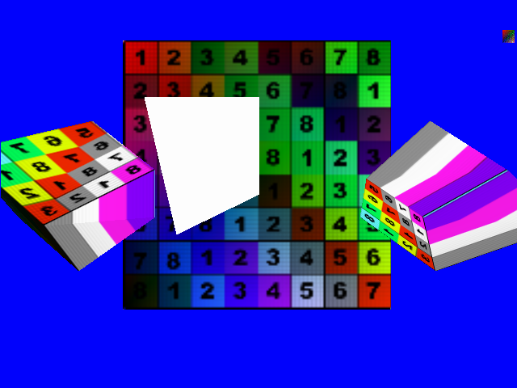

# CPUDrivenGPUTest1

This project was aimed at exploring the connection between CPU and the SWTnL FPGA GPU. The GPU is configured to accept commands (currently over serial UART) from the CPU in the form of command packets. To facilitate this, the GPU has a Command Processor unit that decodes packets and passes along the commands inside to the other units in the GPU. In this way, the CPU can configure and control the GPU.

Currently the SWTnL nature of the architecture and the reliance of the GPU to wait for the CPU to provide input over the (glacially) slow serial UART interface are the main bottlenecks for GPU rendering performance. In future iterations, implementing HWTnL and upgrading from 1Mbit/s serial to 1Gbit/s Ethernet will provide big improvements in performance.

View the hardware-side of this project [here](CPUDrivenGPUTest1.srcs).

See more info about the driver-side of this project [here](Software_d3d9_Driver).
