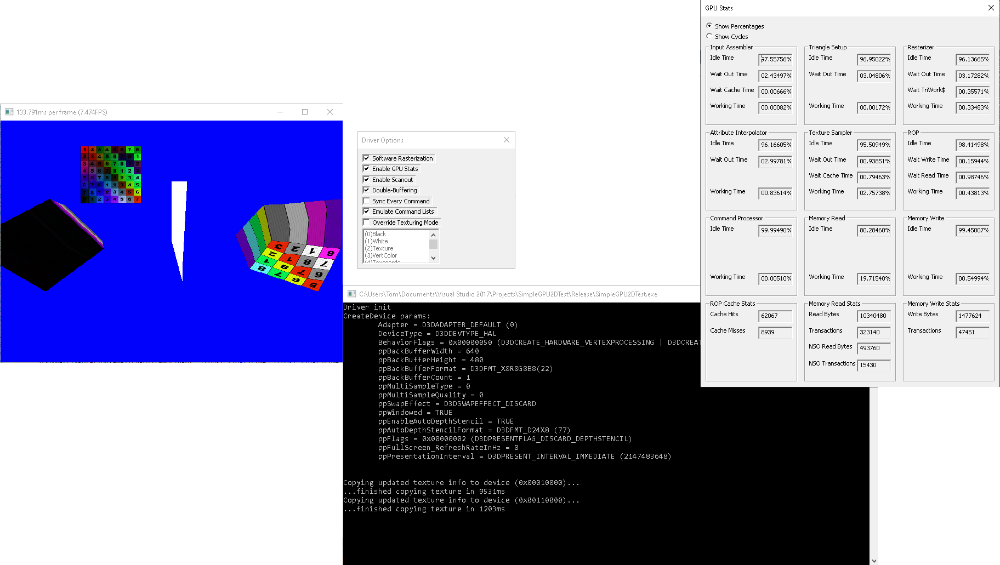

# Software_D3D9_Driver

Wraps the D3D9 API and performs the functions of a usermode, SWTnL driver. Vertex shading is computed on the CPU and the results are then uploaded to the FPGA GPU. This driver is heavily based on the existing Software_D3D9 codebase for a functional software-rasterized D3D9 renderer. Much more documentation can be found [there](https://github.com/code-tom-code/Software_D3D9).

## Authors

* **Tom Lopes** - *Initial work* - [code-tom-code](https://github.com/code-tom-code)
