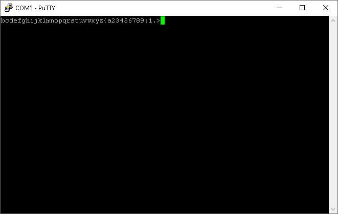

# Test_AXI_UartLite

This project was my first attempt at writing an AXI4 interface. I had looked over other peoples' interfaces in the past (including the Xilinx AXI4 templates built into Vivado, from which mine was based), however I had never gotten around to writing one myself. For this test, I created a simple state machine to server as an AXI4-Lite Master for the AXI4-Lite Slave that is the "UART Lite" IP that comes with Vivado. I couldn't just have the loopback mechanism relay the same input I had sent to it, so I had it send back the input "plus one" character (so for instance 'A' becomes 'B' and so on).

The UART Lite IP for this example is configured to run with these serial port settings:
- 921,600 bps
- 8 data bits per character
- 1 stop bit
- ODD parity
- XON/XOFF flow control enabled
